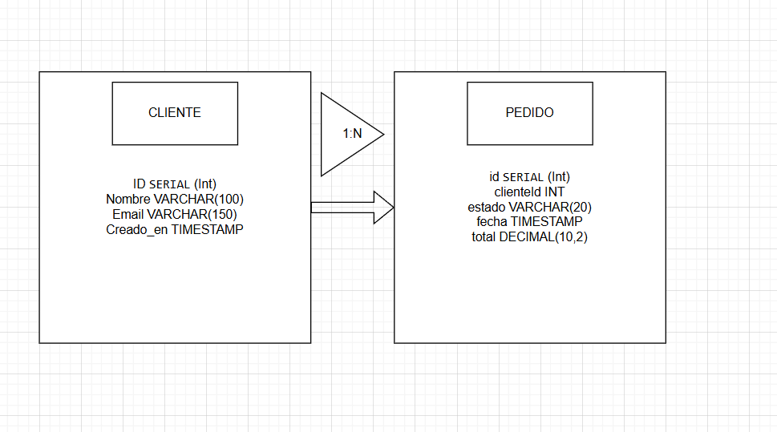

#Diagrama Entidad relación para Postgres

Instalamos las dependencias 

"npm install express @prisma/client"
"npm install -D prisma nodemon"

Inicializamos Prisma
"npx prisma init"

En nuestro .env ponemos la conexion a nuestro postgress
DB_HOST=localhost
DB_PORT=5432
DB_USER=postgres
DB_PASS=postgres
DB_NAME=practica2
DATABASE_URL="postgresql://${DB_USER}:${DB_PASS}@${DB_HOST}:${DB_PORT}/${DB_NAME}?schema=public"

Ejecutamos migraciones
"npx prisma migrate dev --name init"

Ponemos los datos iniciales con

"npx prisma db seed"

Corremos migraciones y seeds

"npx prisma migrate dev"
"npx prisma db seed"

Iniciamos el servido

"npx nodemon src/server.js"

Probamos la ruta en POSTMAN
GET http://localhost:3000/pedidos?clienteId=1&estado=pendiente&sort=fecha,desc&page=1&limit=5
